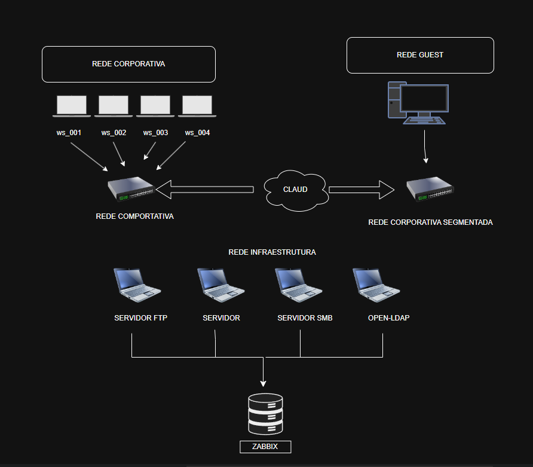

Relatório Técnico – Lab Segmentação de Rede

**Autor:** Matheus Rosa                                                              **Data:** 28/07/2025
**Versão:** 1.0

---

### 📄 Sumário Executivo

Durante a análise da rede segmentada simulada em ambiente Docker, foram identificadas três redes principais: **corp_net**, **guest_net** e **infra_net**. A exploração ativa dos hosts revelou serviços desnecessários expostos, autenticação fraca ou inexistente e falhas comuns de configuração. Recomendamos a remoção de serviços inseguros, segmentação mais restritiva e o reforço das autenticações nos serviços essenciais. A rede permite que atacantes se movam internamente (escalonamento lateral) e causem vazamento de dados.

---

### 🔢 Objetivo

Realizar a análise de uma infraestrutura de rede segmentada simulada, com foco na identificação de exposições, falhas de segmentação e riscos operacionais.

---

### 🔎 Escopo

Ambiente Docker composto por vários hosts distribuídos em três redes lógicas: **corp**, **infra** e **guest**. Cada uma simula um ambiente comum corporativo (usuários internos, servidores e visitantes/externos).

---

### 🔧 Metodologia

- **Ferramentas utilizadas:** `nmap`, `rustscan`, `arp-scan`, `ping`, `whois`, `dig`, `curl`, `ftp`, `arp`, `net-tools`
- Coleta ativa de dados das três redes
- Análise de serviços, portas, respostas de aplicações e configurações
- Armazenamento de dados estruturado em `/home/analyst/recon/`
- Evidências em txt e prints

---

### 🤖 Diagrama de Rede

---

### 📝 Diagnóstico (Achados)

#### **Rede: corp_net (10.10.10.0/24)**

| Host/IP      | Serviço    | Porta | Risco Identificado                        |
| ------------ | ---------- | ----- | ----------------------------------------- |
| 10.10.10.10  | HTTP       | 80    | Servidor HTTP sem autenticação            |
| 10.10.10.101 | SSH        | 22    | Possível brute-force se senha fraca       |
| 10.10.10.127 | TCP aberto | 139   | Porta comum em malware / lateral movement |

#### **Rede: guest_net (10.10.50.0/24)**

| Host/IP      | Serviço | Porta | Risco Identificado             |
| ------------ | ------- | ----- | ------------------------------ |
| 10.10.50.1   | Gateway | -     | Monitoramento de fluxo externo |
| 10.10.50.222 | TCP     | 80    | Possível webserver exposto     |

#### **Rede: infra_net (10.10.30.0/24)**

| Host/IP      | Serviço     | Porta | Risco Identificado                   |
| ------------ | ----------- | ----- | ------------------------------------ |
| 10.10.30.10  | FTP         | 21    | FTP anônimo habilitado               |
| 10.10.30.11  | MySQL       | 3306  | Exposto sem firewall ou ACL          |
| 10.10.30.15  | SMB         | 445   | Compartilhamentos SMB acessíveis     |
| 10.10.30.17  | LDAP        | 389   | Respostas completas sem autenticação |
| 10.10.30.117 | HTTP/Zabbix | 80    | Interface Zabbix exposta na rede     |

---

### 💼 Recomendações

- Desabilitar FTP anônimo e usar SFTP
- Restringir acesso à porta 3306 por IP
- Bloquear porta 445 para redes externas (invulnerável com firewall)
- Adicionar autenticação nos serviços web expostos
- Utilizar VLANs ou ACLs para reduzir comunicação entre redes

---

### 📊 Plano de Ação (80/20)

| Ação                     | Impacto | Facilidade | Prioridade |
| ------------------------ | ------- | ---------- | ---------- |
| Isolar printer (guest)   | Alto    | Média      | Alta       |
| Desativar FTP anônimo    | Alto    | Alta       | Alta       |
| Bloquear porta 445       | Alto    | Alta       | Alta       |
| Limitar acesso MySQL     | Médio   | Média      | Alta       |
| Implementar firewall ACL | Alto    | Baixa      | Média      |

---

### 🛌 Conclusão

A segmentação da rede está funcional, mas não suficiente para impedir movimentação lateral e exploração de serviços desprotegidos. Medidas corretivas simples podem trazer ganhos significativos de segurança com pouco esforço. Priorizamos a desativação de serviços desnecessários e a restrição de acessos entre as sub-redes.

---

### 📎 Anexos

https://github.com/MatheusRozza7/DesafioCybersecurity.git
